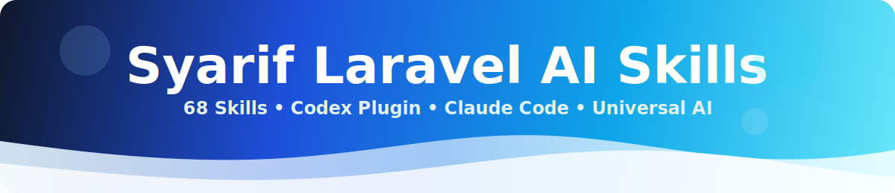

# Syarif Laravel AI Skills

<p align="center">
  
</p>

<p align="center">
  <a href="https://github.com/soden46/syarif-laravel-ai-skills/releases"></a>
  <a href="https://github.com/soden46/syarif-laravel-ai-skills/blob/main/LICENSE"></a>
  <a href="https://github.com/soden46/syarif-laravel-ai-skills/tree/main/skills"></a>
  <a href="https://www.codex-marketplace.com/plugins/syarif-laravel-ai-skills"></a>
  <a href="https://github.com/soden46/syarif-laravel-ai-skills/stargazers"></a>
</p>

Laravel-focused AI skills for Codex, Claude Code, and any AI coding assistant that can read Markdown files. Install them with `npx skills add`, use the generated plugin packages, or point a generic assistant at the universal manifest and canonical `skills/` folder.

Skills follow the [Agent Skills](https://agentskills.io/) format.

Language: [English](#english) | [Bahasa Indonesia](#bahasa-indonesia)

<a id="english"></a>

<details open>
<summary><strong>English</strong></summary>

## What You Get

- **72 installable Laravel skills** - a broad Laravel skill catalog for day-to-day Laravel work.
- **Personal core standards** - 12 local standards extracted from reviewed Laravel projects, with client details removed.
- **Public topic coverage** - 59 additional topics mapped from public Laravel skill catalogs without copying third-party skill body text.
- **Responsive UI testing** - a focused Playwright skill for mobile, tablet, desktop, overflow, clipping, tables, modals, navigation, and Livewire state checks.
- **Simple discovery** - `npx skills add <repo> --list` reads each `skills/<folder>/SKILL.md`.
- **Universal assistant support** - usable by Codex, Claude Code, Copilot, Cursor, Windsurf, Cline, Aider, OpenCode, Gemini CLI, and generic agents that can read files.

## Installation

Browse the skills.sh page:

```text
https://skills.sh/soden46/syarif-laravel-ai-skills
```

List available skills:

```bash
npx skills add soden46/syarif-laravel-ai-skills --list
```

Install all skills:

```bash
npx skills add soden46/syarif-laravel-ai-skills -s "*" -y
```

Install all skills globally for Codex:

```bash
npx skills add soden46/syarif-laravel-ai-skills -g -a codex -s "*" -y
```

Interactive install prompt:

```text
Select the Laravel App Skills group to select every skill, then press Enter.
```

Install one skill:

```bash
npx skills add soden46/syarif-laravel-ai-skills -g -a codex -s form-requests -y
```

Verify installation:

```bash
npx skills list --global --agent codex
```

## Codex Plugin

This repository can be submitted directly to codex-marketplace.com because the root `.codex-plugin/plugin.json` points to canonical `skills/`.

This repo also ships a Codex plugin marketplace:

```bash
codex plugin marketplace add soden46/syarif-laravel-ai-skills --ref main
codex plugin add syarif-laravel-ai-skills@syarif-laravel-ai-skills
```

For local development from this checkout:

```bash
codex plugin marketplace add .
codex plugin add syarif-laravel-ai-skills@syarif-laravel-ai-skills
```

## Claude Code Plugin

The generated Claude plugin package lives at `plugins/laravel-app-skills`:

```bash
claude --plugin-dir ./plugins/laravel-app-skills
```

Inside Claude Code, reload and call a skill:

```text
/reload-plugins
/laravel-app-skills:using-laravel-standards
```

For personal-only usage without a plugin package, install skills directly:

```bash
npx skills add soden46/syarif-laravel-ai-skills -g -a claude-code -s "*" -y
```

## Universal AI Usage

For assistants without native skill/plugin support, add this repo to the workspace and start with:

```text
Read AGENTS.md, then use skills/using-laravel-standards/SKILL.md as the entry skill for this Laravel repo. Load focused skills from skills/<skill-name>/SKILL.md only when relevant to the task.
```

Machine-readable metadata lives in `agent-skills.json`. Full assistant-specific notes are in [docs/UNIVERSAL_USAGE.md](docs/UNIVERSAL_USAGE.md).

## Quick Start

After installation, ask your assistant to start with:

```text
Use using-laravel-standards for this Laravel repo.
```

For focused tasks, call a smaller skill directly:

```text
Use form-requests to move this validation out of the controller.
Use transactions-and-consistency to review this checkout flow.
Use quality-checks before final handoff.
```

## What's Inside

### Core Local Standards

- `using-laravel-standards` - entry point and skill selector.
- `extract-laravel-standards` - audit finished projects and propose reusable standards.
- `architecture` - Laravel-native architecture decisions.
- `controller-cleanup` - thin controllers and route boundaries.
- `form-requests` - validation and request authorization.
- `actions-and-services` - use-case boundaries, services, and integrations.
- `database-transactions` - atomic writes, locks, and after-commit work.
- `eloquent-patterns` - explicit models, relationships, and query shape.
- `livewire-patterns` - Livewire boundaries, state, authorization, and tests.
- `queues-and-jobs` - jobs, schedules, workers, and operational safety.
- `security` - authorization, request forgery, uploads, secrets, and APIs.
- `testing` - focused tests and verification before handoff.

### Topic Coverage

- **Workflow** - `bootstrap-check`, `runner-selection`, `daily-workflow`, `brainstorming`, `writing-plans`, `executing-plans`.
- **Modern app workflow** - `laravel-specialist`, `laravel-11-12-app-guidelines`.
- **Architecture** - `ports-and-adapters`, `interfaces-and-di`, `strategy-pattern`, `template-method-and-plugins`, `complexity-guardrails`.
- **HTTP and APIs** - `routes-best-practices`, `api-resources-and-pagination`, `api-surface-evolution`, `rate-limiting`.
- **Data and Eloquent** - `migrations-and-factories`, `eloquent-relationships`, `data-chunking-large-datasets`, `transactions-and-consistency`.
- **Quality and tests** - `tdd-with-pest`, `controller-tests`, `e2e-playwright`, `quality-checks`.
- **Responsive UI** - `responsive-ui-testing`.
- **Operations and security** - `queues-and-horizon`, `horizon-metrics-and-dashboards`, `http-client-resilience`, `filesystem-uploads`, `exception-handling-and-logging`.
- **Performance** - `laravel-database-optimization`, `performance-caching`, `performance-eager-loading`, `performance-select-columns`.
- **Laravel 13+** - `ai-sdk`, `vector-search`, `php-attributes`, `request-forgery-protection`, `upgrade-13`.
- **Prompting and collaboration** - `effective-context`, `prompt-structure`, `debugging-prompts`, `code-review-requests`.

Run the list command for the complete catalog, or read [docs/SUPERPOWERS_SKILL_MAPPING.md](docs/SUPERPOWERS_SKILL_MAPPING.md) and [docs/LARAVEL_SKILLS_CLOUD_MAPPING.md](docs/LARAVEL_SKILLS_CLOUD_MAPPING.md) for public-topic mapping.

## How It Works

1. Each installable skill lives at `skills/<skill-folder>/SKILL.md`.
2. The `name` frontmatter uses `<skill-folder>`.
3. The `description` frontmatter appears in `npx skills add <repo> --list`.
4. The `tags` frontmatter includes `laravel` and `php` for Laravel Skills import.
5. `skills.sh.json` groups the skills shown on the skills.sh repository page.
6. `plugin-groups.json` assigns every skill to an installable plugin bundle.
7. `agent-skills.json` exposes neutral metadata for generic AI assistants and integration tools.
8. `.codex-plugin/plugin.json` exposes the repo root as a codex-marketplace.com artifact and points directly to `skills/`.
9. `.agents/plugins/marketplace.json` exposes the repo as a Codex/ChatGPT plugin marketplace.
10. `plugins/laravel-app-skills/.claude-plugin/plugin.json` makes the generated bundle usable with `claude --plugin-dir` after `npm run sync`.
11. `npm run sync` regenerates `agent-skills.json`, `.codex-plugin/plugin.json`, `.agents/plugins/marketplace.json`, `.claude-plugin/marketplace.json`, and local generated plugin output.
12. Generated `plugins/<plugin>/skills/` copies are ignored in Git so marketplace submissions stay under the 128-file scan limit.
13. `package.json` is only for local helper scripts. Users install from GitHub with `npx skills add`, not `npm install`.

## Marketplace Indexing

This repository is designed for skills.sh and Laravel Skills discovery:

1. `skills.sh` sees GitHub repositories after someone installs from the repo with the `skills` CLI.
2. `skills.sh` repo pages are cached, so updates can take time after a valid install.
3. Each skill includes `laravel` and `php` tags for Laravel Skills classification.
4. `skills.laravel.cloud` imports from the skills.sh ecosystem and lists Laravel/PHP skills after its import and security-audit pass.
5. Run `npx skills add soden46/syarif-laravel-ai-skills -s "*" -y` after pushing a release to refresh skills.sh telemetry.

## Local Development

```bash
npm run validate
npm run list
npm run install:local
npm run sync
```

To sync missing public topics from Superpowers Laravel:

```bash
npm run import:superpowers
npm run validate
npx skills add . --list
```

Use [docs/ADDING_SKILLS.md](docs/ADDING_SKILLS.md) as the standard for every future skill.

For contribution rules, privacy checks, and PR checklist, read [CONTRIBUTING.md](CONTRIBUTING.md).

## Reference

This README follows the readable documentation pattern from [jpcaparas/superpowers-laravel](https://github.com/jpcaparas/superpowers-laravel): clear summary, install commands, quick start, catalog overview, workflow notes, and release links.

Related files:

- [RELEASE-NOTES.md](RELEASE-NOTES.md)
- [CHANGELOG.md](CHANGELOG.md)
- [CONTRIBUTING.md](CONTRIBUTING.md)
- [docs/ADDING_SKILLS.md](docs/ADDING_SKILLS.md)
- [docs/BILINGUAL_MARKDOWN.md](docs/BILINGUAL_MARKDOWN.md)
- [docs/LARAVEL_SKILLS_CLOUD_MAPPING.md](docs/LARAVEL_SKILLS_CLOUD_MAPPING.md)
- [docs/UNIVERSAL_USAGE.md](docs/UNIVERSAL_USAGE.md)

## License

MIT License - see [LICENSE](LICENSE).

</details>

<a id="bahasa-indonesia"></a>

<details>
<summary><strong>Bahasa Indonesia</strong></summary>

## Yang Didapat

- **72 skill Laravel installable** - katalog skill Laravel yang luas untuk pekerjaan Laravel sehari-hari.
- **Standar inti pribadi** - 12 standar lokal dari proyek Laravel yang sudah direview, tanpa detail client.
- **Cakupan topik publik** - 59 topik tambahan yang dimapping dari katalog skill Laravel publik tanpa menyalin isi body skill pihak ketiga.
- **Responsive UI testing** - skill Playwright khusus untuk mobile, tablet, desktop, overflow, clipping, tabel, modal, navigasi, dan state Livewire.
- **Discovery sederhana** - `npx skills add <repo> --list` membaca setiap `skills/<folder>/SKILL.md`.
- **Support AI universal** - bisa dipakai Codex, Claude Code, Copilot, Cursor, Windsurf, Cline, Aider, OpenCode, Gemini CLI, dan agent generik yang bisa membaca file.

## Instalasi

Lihat halaman skills.sh:

```text
https://skills.sh/soden46/syarif-laravel-ai-skills
```

Lihat daftar skill:

```bash
npx skills add soden46/syarif-laravel-ai-skills --list
```

Install semua skill:

```bash
npx skills add soden46/syarif-laravel-ai-skills -s "*" -y
```

Install semua skill global untuk Codex:

```bash
npx skills add soden46/syarif-laravel-ai-skills -g -a codex -s "*" -y
```

Prompt install interaktif:

```text
Pilih group Laravel App Skills untuk memilih semua skill, lalu tekan Enter.
```

Install satu skill:

```bash
npx skills add soden46/syarif-laravel-ai-skills -g -a codex -s form-requests -y
```

Cek hasil install:

```bash
npx skills list --global --agent codex
```

## Plugin Codex

Repository ini bisa langsung disubmit ke codex-marketplace.com karena root `.codex-plugin/plugin.json` menunjuk ke canonical `skills/`.

Repo ini juga menyediakan marketplace plugin Codex:

```bash
codex plugin marketplace add soden46/syarif-laravel-ai-skills --ref main
codex plugin add syarif-laravel-ai-skills@syarif-laravel-ai-skills
```

Untuk development lokal dari checkout ini:

```bash
codex plugin marketplace add .
codex plugin add syarif-laravel-ai-skills@syarif-laravel-ai-skills
```

## Plugin Claude Code

Package plugin Claude yang digenerate ada di `plugins/laravel-app-skills`:

```bash
claude --plugin-dir ./plugins/laravel-app-skills
```

Di dalam Claude Code, reload lalu panggil skill:

```text
/reload-plugins
/laravel-app-skills:using-laravel-standards
```

Kalau cuma dipakai sendiri tanpa package plugin, install skill langsung:

```bash
npx skills add soden46/syarif-laravel-ai-skills -g -a claude-code -s "*" -y
```

## Penggunaan AI Universal

Untuk assistant yang belum punya support skill/plugin native, masukkan repo ini ke workspace lalu mulai dengan:

```text
Read AGENTS.md, then use skills/using-laravel-standards/SKILL.md as the entry skill for this Laravel repo. Load focused skills from skills/<skill-name>/SKILL.md only when relevant to the task.
```

Metadata machine-readable ada di `agent-skills.json`. Catatan lengkap per assistant ada di [docs/UNIVERSAL_USAGE.md](docs/UNIVERSAL_USAGE.md).

## Quick Start

Setelah install, minta assistant mulai dari:

```text
Use using-laravel-standards for this Laravel repo.
```

Untuk task yang lebih spesifik, panggil skill kecil langsung:

```text
Use form-requests to move this validation out of the controller.
Use transactions-and-consistency to review this checkout flow.
Use quality-checks before final handoff.
```

## Isi Repository

### Standar Inti Lokal

- `using-laravel-standards` - entry point dan pemilih skill.
- `extract-laravel-standards` - audit proyek selesai dan usulkan standar reusable.
- `architecture` - keputusan arsitektur Laravel-native.
- `controller-cleanup` - controller tipis dan batas route.
- `form-requests` - validasi dan request authorization.
- `actions-and-services` - use-case boundary, service, dan integrasi.
- `database-transactions` - atomic write, lock, dan after-commit work.
- `eloquent-patterns` - model, relationship, dan query shape yang eksplisit.
- `livewire-patterns` - boundary Livewire, state, authorization, dan test.
- `queues-and-jobs` - job, schedule, worker, dan operational safety.
- `security` - authorization, request forgery, upload, secret, dan API.
- `testing` - test yang fokus dan verifikasi sebelum handoff.

### Cakupan Topik

- **Workflow** - `bootstrap-check`, `runner-selection`, `daily-workflow`, `brainstorming`, `writing-plans`, `executing-plans`.
- **Workflow aplikasi modern** - `laravel-specialist`, `laravel-11-12-app-guidelines`.
- **Arsitektur** - `ports-and-adapters`, `interfaces-and-di`, `strategy-pattern`, `template-method-and-plugins`, `complexity-guardrails`.
- **HTTP dan API** - `routes-best-practices`, `api-resources-and-pagination`, `api-surface-evolution`, `rate-limiting`.
- **Data dan Eloquent** - `migrations-and-factories`, `eloquent-relationships`, `data-chunking-large-datasets`, `transactions-and-consistency`.
- **Quality dan test** - `tdd-with-pest`, `controller-tests`, `e2e-playwright`, `quality-checks`.
- **Responsive UI** - `responsive-ui-testing`.
- **Operasional dan security** - `queues-and-horizon`, `horizon-metrics-and-dashboards`, `http-client-resilience`, `filesystem-uploads`, `exception-handling-and-logging`.
- **Performance** - `laravel-database-optimization`, `performance-caching`, `performance-eager-loading`, `performance-select-columns`.
- **Laravel 13+** - `ai-sdk`, `vector-search`, `php-attributes`, `request-forgery-protection`, `upgrade-13`.
- **Prompting dan kolaborasi** - `effective-context`, `prompt-structure`, `debugging-prompts`, `code-review-requests`.

Jalankan command list untuk katalog lengkap, atau baca [docs/SUPERPOWERS_SKILL_MAPPING.md](docs/SUPERPOWERS_SKILL_MAPPING.md) dan [docs/LARAVEL_SKILLS_CLOUD_MAPPING.md](docs/LARAVEL_SKILLS_CLOUD_MAPPING.md) untuk mapping topik publik.

## Cara Kerja

1. Setiap skill installable berada di `skills/<skill-folder>/SKILL.md`.
2. Frontmatter `name` memakai format `<skill-folder>`.
3. Frontmatter `description` tampil di `npx skills add <repo> --list`.
4. Frontmatter `tags` berisi `laravel` dan `php` untuk import Laravel Skills.
5. `skills.sh.json` mengelompokkan skill yang tampil di halaman repository skills.sh.
6. `plugin-groups.json` menempatkan setiap skill ke bundle plugin installable.
7. `agent-skills.json` menyediakan metadata netral untuk AI assistant generik dan tool integrasi.
8. `.codex-plugin/plugin.json` membuat root repo bisa discan sebagai artifact codex-marketplace.com dan langsung menunjuk ke `skills/`.
9. `.agents/plugins/marketplace.json` membuat repo ini bisa dipakai sebagai marketplace plugin Codex/ChatGPT.
10. `plugins/laravel-app-skills/.claude-plugin/plugin.json` membuat bundle generated bisa dipakai dengan `claude --plugin-dir` setelah `npm run sync`.
11. `npm run sync` membuat ulang `agent-skills.json`, `.codex-plugin/plugin.json`, `.agents/plugins/marketplace.json`, `.claude-plugin/marketplace.json`, dan output plugin generated lokal.
12. Copy generated `plugins/<plugin>/skills/` di-ignore dari Git supaya submission marketplace tetap di bawah limit scan 128 file.
13. `package.json` hanya untuk helper script lokal. User install dari GitHub dengan `npx skills add`, bukan `npm install`.

## Indexing Marketplace

Repository ini disiapkan untuk discovery skills.sh dan Laravel Skills:

1. `skills.sh` melihat repository GitHub setelah ada yang install dari repo memakai `skills` CLI.
2. Halaman repo `skills.sh` memakai cache, jadi update bisa butuh waktu setelah install valid.
3. Setiap skill punya tag `laravel` dan `php` untuk klasifikasi Laravel Skills.
4. `skills.laravel.cloud` import dari ekosistem skills.sh dan menampilkan skill Laravel/PHP setelah proses import dan security audit lolos.
5. Jalankan `npx skills add soden46/syarif-laravel-ai-skills -s "*" -y` setelah push release untuk refresh telemetry skills.sh.

## Development Lokal

```bash
npm run validate
npm run list
npm run install:local
npm run sync
```

Untuk sync topik publik yang belum ada dari Superpowers Laravel:

```bash
npm run import:superpowers
npm run validate
npx skills add . --list
```

Gunakan [docs/ADDING_SKILLS.md](docs/ADDING_SKILLS.md) sebagai standar setiap kali menambah skill baru.

Untuk aturan kontribusi, pengecekan privasi, dan checklist PR, baca [CONTRIBUTING.md](CONTRIBUTING.md).

## Referensi

README ini mengikuti pola dokumentasi yang mudah dibaca dari [jpcaparas/superpowers-laravel](https://github.com/jpcaparas/superpowers-laravel): ringkasan jelas, command install, quick start, overview katalog, catatan workflow, dan link release.

File terkait:

- [RELEASE-NOTES.md](RELEASE-NOTES.md)
- [CHANGELOG.md](CHANGELOG.md)
- [CONTRIBUTING.md](CONTRIBUTING.md)
- [docs/ADDING_SKILLS.md](docs/ADDING_SKILLS.md)
- [docs/BILINGUAL_MARKDOWN.md](docs/BILINGUAL_MARKDOWN.md)
- [docs/LARAVEL_SKILLS_CLOUD_MAPPING.md](docs/LARAVEL_SKILLS_CLOUD_MAPPING.md)
- [docs/UNIVERSAL_USAGE.md](docs/UNIVERSAL_USAGE.md)

## Lisensi

MIT License - lihat [LICENSE](LICENSE).

</details>
